# Dynamic Acceptor Session Definition

Sometimes an application needs more flexibility than a static configuration provides. For example, test programs, simulators, or SaaS gateways may not want to pre-define every single session.

```mermaid
flowchart TD
    A[Incoming TCP Connection] --> B[Parse Logon 35=A]
    B --> C{Session Exists?}
    C -- Yes --> D[Use Existing Session]
    C -- No --> E[Consult DynamicAcceptorSessionProvider]
    
    E --> F{Provider Approves?}
    F -- Yes --> G[Create Session Dynamically<br/>using AcceptorTemplate]
    G --> H[Trigger onCreate]
    F -- No --> I[Disconnect / Reject Logon]
    
    style G fill:#14532d,stroke:#22c55e
    style I fill:#450a0a,stroke:#ef4444
```



Dynamic sessions are implemented using a *session provider*. A simple session provider implementation, `DynamicAcceptorSessionProvider`, is available for these scenarios. This provider specifies a session ID for a session definition that will be used as a template for setting session options. The session template in the configuration file should be marked with the `AcceptorTemplate=Y` setting so the session will not be registered as a normal static session.

You programmatically associate a specific acceptor socket address with a session provider instance. A dynamic session will be created for any logon attempt on this socket address if a session has not already been defined. This allows a mixture of static session definitions and dynamic session definitions on the same acceptor socket.

### Registration of a Dynamic Session Provider

```java
acceptor.setSessionProvider(socketAddress, new DynamicAcceptorSessionProvider(
   settings, templateSessionID, application, messageStoreFactory, logFactory,
   messageFactory));
```

### Example Acceptor Configuration for Dynamic Sessions

```properties
[DEFAULT]
FileStorePath=target/data/executor
ConnectionType=acceptor
SocketAcceptPort=9876
StartTime=00:00:00
EndTime=00:00:00
HeartBtInt=30
ValidOrderTypes=1,2,F
SenderCompID=*
TargetCompID=*
UseDataDictionary=Y
DefaultMarketPrice=15

[SESSION]
AcceptorTemplate=Y
DataDictionary=FIX40.xml
BeginString=FIX.4.0
```
