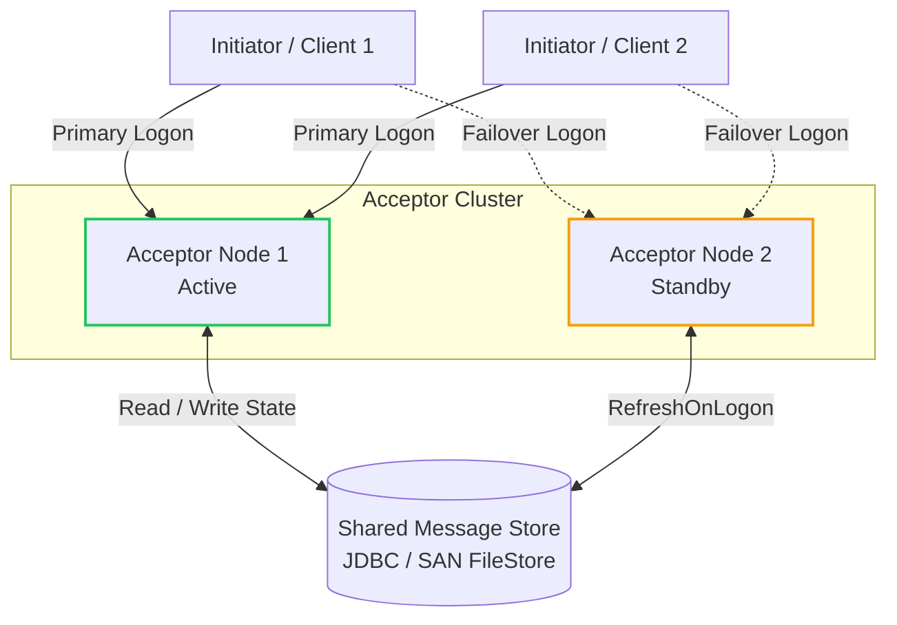

# Acceptor Failover Support

When using a MessageStore that supports shared data (FileStore, JdbcStore, and SleepycatStore), the Session can be configured to refresh the store information upon logon using the `RefreshOnLogon=Y` configuration.



You would typically run two acceptor processes using a shared message store. One process would be the active acceptor and the other would be the standby for any specific session. 

If one acceptor process dies, the client (assuming they have been configured with failover addresses) will attempt to logon to the other acceptor. When they do, the message store for that session will be refreshed and the session should continue normally.

### Example Acceptor Configuration with Failover

```properties
[DEFAULT]
FileStorePath=target/data/server
DataDictionary=etc/FIX42.xml
BeginString=FIX.4.2
ConnectionType=acceptor
StartTime=00:00:00
EndTime=00:00:00
HeartBtInt=30
SocketAcceptPort=9877
RefreshOnLogon=Y

[SESSION]
SenderCompID=EXEC
TargetCompID=BANZAI
```

Note that this approach doesn't require each acceptor to be globally in an active or standby role. Since that role is session-specific, both acceptors could be actively supporting different sessions. When one node dies, all the sessions on that node will automatically switch to the other node. This is implemented simply by specifying the order of the failover addresses in the QuickFIX/J client settings so that some clients initially connect to one node and others connect to the other node. 
