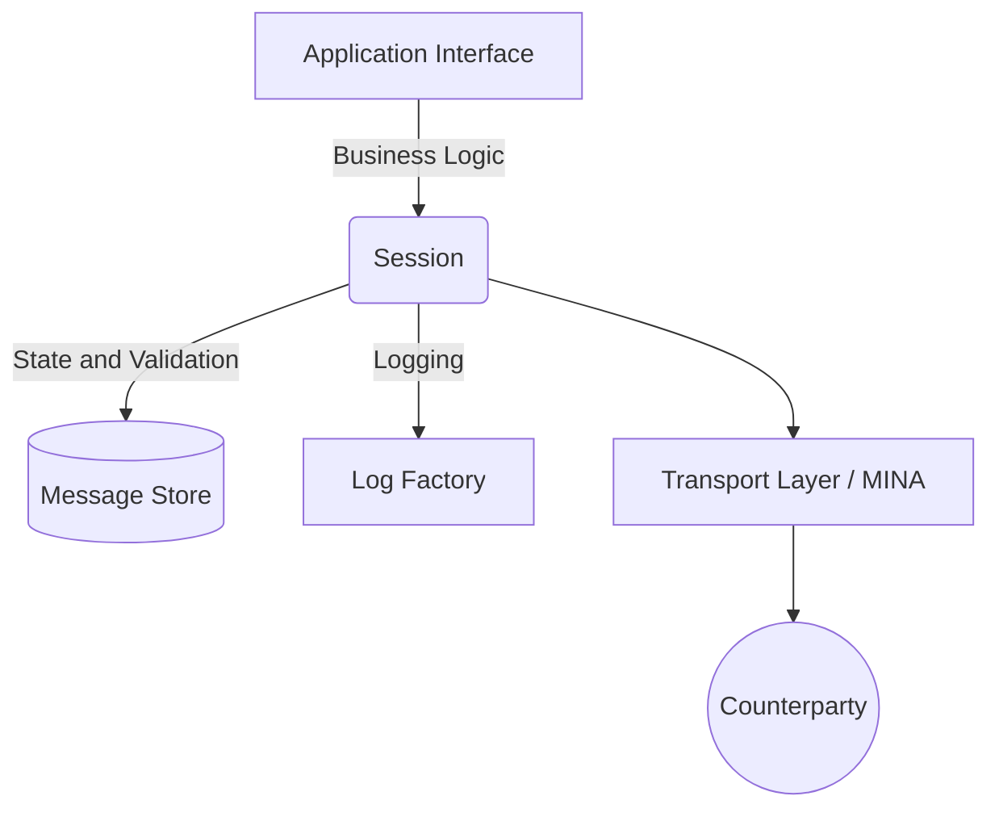

# Architecture

Understanding the architecture of QuickFIX/J is critical for tuning performance, configuring persistence, and seamlessly integrating it into your trading platform. 

The QuickFIX/J engine is designed using a layered architecture that cleanly separates transport mechanisms, session management, state persistence, and application-level business logic.

## High-Level Components

### The `Session`
The `Session` is the heart of QuickFIX/J. It represents a single, bidirectional FIX connection between two counterparties, uniquely identified by a `SessionID` (which consists of the FIX version, `SenderCompID`, and `TargetCompID`). 

The Session is responsible for:
* **State Management:** Tracking expected incoming and outgoing sequence numbers.
* **Message Validation:** Checking incoming messages against the `DataDictionary` (XML specification) to ensure required tags are present and valid.
* **Session-Level Operations:** Automatically handling Admin messages such as `Logon` (35=A), `Heartbeat` (35=0), `TestRequest` (35=1), `ResendRequest` (35=2), and `SequenceReset` (35=4).
* **Message Dispatching:** Routing valid Application-level messages to your custom code.

### The `Application` Interface
The `Application` interface is your bridge to the QuickFIX/J engine. You implement this interface to receive callbacks when specific events occur in the session lifecycle.
* `onCreate(SessionID)`
* `onLogon(SessionID)`
* `onLogout(SessionID)`
* `toAdmin(Message, SessionID)`
* `fromAdmin(Message, SessionID)`
* `toApp(Message, SessionID)`
* `fromApp(Message, SessionID)`

### Transport Layer
QuickFIX/J utilizes **Apache MINA** (Multipurpose Infrastructure for Network Applications) for its asynchronous I/O operations. This provides robust handling of TCP/IP sockets, enabling QuickFIX/J to process thousands of connections concurrently using Java NIO (Non-blocking I/O) with minimal thread overhead.

### Message Store (`MessageStore`)
To guarantee delivery and facilitate message recovery (via `ResendRequest` handling), QuickFIX/J must persist message data and sequence numbers. Pluggable implementations include:
* **MemoryStore:** High performance with zero I/O overhead. State is lost on restart, making it ideal for internal testing or connections that do not enforce strict intraday sequencing.
* **FileStore:** Standard, durable disk-based persistence. It writes messages and sequence numbers to plain text files.
* **JdbcStore:** Persists messages and session state to a relational database. Useful for centralized monitoring and auditing.
* **SleepycatStore:** High-performance, embedded database persistence.

### Logging (`Log`)
QuickFIX/J logs both raw FIX messages (incoming/outgoing) and engine system events.
* **FileLog:** Writes to local files on disk.
* **SLF4JLog:** The recommended approach. Integrates with modern Java logging facades (Logback, Log4j2), allowing centralized and structured logging.
* **JdbcLog:** Writes logs to a database.
* **ScreenLog:** Outputs directly to `System.out` (useful for development).

## Threading Models

QuickFIX/J offers distinct threading models for connection handling, tailored for different deployment scales.

1. **SocketAcceptor / SocketInitiator (NIO Thread Pool)**
   Uses a thread pool driven by Java NIO via Apache MINA. This model scales exceptionally well and is best for handling tens, hundreds, or thousands of concurrent FIX sessions. It multiplexes I/O operations across a small number of worker threads.

2. **ThreadedSocketAcceptor / ThreadedSocketInitiator (One-Thread-Per-Session)**
   Spawns a dedicated thread for processing messages on each connection. Ideal for scenarios with a small number of high-throughput connections where you want to eliminate context-switching overhead and allocate maximum CPU time directly to message processing.

For a deep technical reference on the threading internals — including the `EventHandlingStrategy` implementations, the `QFJ Timer` thread, `Session.next()` behaviour, and queue back-pressure — see the [Threading Model Technical Reference](https://github.com/quickfix-j/quickfixj/blob/master/docs/threading-model.md).
