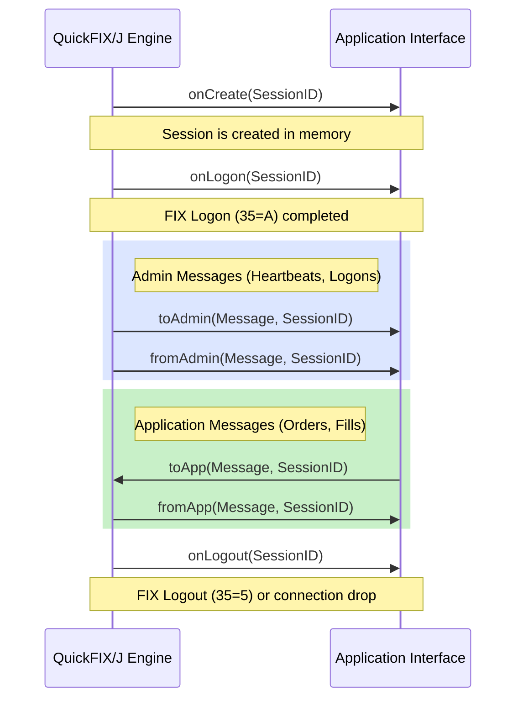

# Developer Documentation (Using QuickFIX/J)

This section provides practical guidance on how to build applications using QuickFIX/J, handle message callbacks, and construct strongly-typed FIX messages.

## The Application Interface

Your main interaction with QuickFIX/J is through the `quickfix.Application` interface. You must provide an implementation of this interface when bootstrapping the engine.



```java
import quickfix.*;

public class MyApplication implements Application {

    @Override
    public void onCreate(SessionID sessionId) {
        // Called when QuickFIX/J creates a new session internally.
    }

    @Override
    public void onLogon(SessionID sessionId) {
        // Called when a successful FIX Logon (35=A) has occurred.
    }

    @Override
    public void onLogout(SessionID sessionId) {
        // Called when a FIX Logout (35=5) has occurred or the connection dropped.
    }

    @Override
    public void toAdmin(Message message, SessionID sessionId) {
        // Called BEFORE an admin message is sent out.
        // Use this to inject passwords, usernames, or custom tags into the Logon message.
    }

    @Override
    public void fromAdmin(Message message, SessionID sessionId) throws FieldNotFound, IncorrectDataFormat, IncorrectTagValue, RejectLogon {
        // Called when an incoming admin message is received.
    }

    @Override
    public void toApp(Message message, SessionID sessionId) throws DoNotSend {
        // Called BEFORE an application message (e.g., NewOrderSingle) is sent out.
    }

    @Override
    public void fromApp(Message message, SessionID sessionId) throws FieldNotFound, IncorrectDataFormat, IncorrectTagValue, UnsupportedMessageType {
        // Called when a valid application message is received.
    }
}
```

## Receiving Messages

In QuickFIX/J, messages are primarily received through the `fromApp` method of your application. There are three main approaches to retrieving data from these messages.

### 1. Recommended Approach: Most Type Safe (MessageCracker)

This is the highly encouraged method. It uses specific message classes generated from FIX specifications and a `MessageCracker` to "crack" the generic message into its specific type.

Your application should extend `MessageCracker` and implement `quickfix.Application`. You then call `crack(message, sessionID)` inside your `fromApp` method, and define `onMessage` handlers for the specific FIX messages you want to process.

QuickFIX/J 1.6 or newer supports a `MessageCracker` that dynamically discovers message handling methods using either a method naming convention or the `@Handler` annotation.

```java
import quickfix.*;
import quickfix.MessageCracker;

public class MyApplication extends MessageCracker implements quickfix.Application {

    @Override
    public void fromApp(Message message, SessionID sessionID)
            throws FieldNotFound, UnsupportedMessageType, IncorrectTagValue {
        crack(message, sessionID);
    }

    // Using the @Handler annotation
    @Handler
    public void myEmailHandler(quickfix.fix50.Email email, SessionID sessionID) {
        // handler implementation
    }

    // By naming convention: method named "onMessage" with message as first arg and SessionID as second.
    // Note: It is an error to have two handlers for the same message type.
    public void onMessage(quickfix.fix44.Email email, SessionID sessionID) {
        // handler implementation
    }
}
```
*Note: Any message type for which you haven't defined a handler will throw an `UnsupportedMessageType` exception by default.*

If you prefer composition over inheritance, you can construct a `MessageCracker` with a delegate object. Handler methods on the delegate will be automatically discovered:

```java
// myDelegate has the message handler methods
MessageCracker cracker = new MessageCracker(myDelegate);
cracker.crack(message, sessionID);
```

### 2. Functional Interfaces (Lambda Support)
For versions 1.6 and newer, you can use `ApplicationFunctionalAdapter` or `ApplicationExtendedFunctionalAdapter` to handle messages using lambda expressions.

```java
import quickfix.ApplicationFunctionalAdapter;

public class EmailForwarder {
    public void init(ApplicationFunctionalAdapter adapter) {
        adapter.addOnLogonListener(this::captureUsername);
        adapter.addFromAppListener(quickfix.fix44.Email.class, (email, sessionID) -> forward(email));
    }

    private void forward(quickfix.fix44.Email email) { /* ... */ }
    private void captureUsername(SessionID sessionID) { /* ... */ }
}
```

Both adapters support multiple registrations to the same event, and callbacks are invoked in FIFO order. However, FIFO order is not guaranteed between a generic listener and a type-specific listener registered for the same event.

### 3. Alternative Approaches to Field Retrieval
If you are not using a `MessageCracker`, you can retrieve fields directly from the generic `Message` object.

* **More Type Safe (Field Classes):** Use field classes (e.g., `Price`, `ClOrdID`).
  ```java
  Price price = new Price();
  message.getField(price);
  ```
* **Least Type Safe:** Use tag numbers directly. This is strongly discouraged.
  ```java
  StringField field = new StringField(44);
  message.getField(field);
  ```

## Sending Messages

Messages are sent using the static `Session.sendToTarget` methods.

```java
public static boolean sendToTarget(Message message) throws SessionNotFound
public static boolean sendToTarget(Message message, SessionID sessionID) throws SessionNotFound
public static boolean sendToTarget(Message message, String senderCompID, String targetCompID) throws SessionNotFound
```

### Recommended Approach: Most Type Safe

This method uses generated message classes that enforce FIX specifications at compile time. The constructor requires all mandatory fields, and the `set()` method ensures only valid fields for that message type are added.

```java
import quickfix.Session;
import quickfix.SessionNotFound;
import quickfix.fix44.NewOrderSingle;
import quickfix.field.*;

public void sendOrder(SessionID sessionID) {
    // Constructor requires mandatory fields for NewOrderSingle
    NewOrderSingle order = new NewOrderSingle(
        new ClOrdID("ORDER-12345"),
        new Side(Side.BUY),
        new TransactTime(),
        new OrdType(OrdType.LIMIT)
    );
    
    // Add additional optional fields using setters
    order.set(new Symbol("AAPL"));
    order.set(new OrderQty(100));
    order.set(new Price(150.25));
    order.set(new TimeInForce(TimeInForce.DAY));

    try {
        // Send the message asynchronously via the session
        boolean success = Session.sendToTarget(order, sessionID);
        if (!success) {
            System.err.println("Message could not be routed. Session may be disconnected.");
        }
    } catch (SessionNotFound e) {
        System.err.println("Session not found: " + sessionID);
    }
}
```

### Alternative: Less Type Safe
If you need to work across multiple FIX versions or message types, you can construct a generic `Message` object.

```java
import quickfix.*;
import quickfix.field.*;

void sendOrderCancelRequest() {
    Message message = new Message();
    Header header = message.getHeader();
    
    header.setField(new BeginString("FIX.4.2"));
    header.setField(new SenderCompID("TW"));
    header.setField(new TargetCompID("TARGET"));
    header.setField(new MsgType("F")); // F = OrderCancelRequest
    
    message.setField(new OrigClOrdID("123"));
    message.setField(new ClOrdID("321"));
    message.setField(new Symbol("LNUX"));
    message.setField(new Side(Side.BUY));
    message.setField(new Text("Cancel My Order!"));
    
    try {
        Session.sendToTarget(message);
    } catch (SessionNotFound e) {
        // Handle error
    }
}
```

### Note on Threading

`Session.sendToTarget()` is thread-safe. You can call it from any thread in your application. The message will be serialized, persisted to the `MessageStore`, and placed on the socket's write buffer asynchronously.

For a full explanation of QuickFIX/J's threading strategies (single-threaded vs. thread-per-session), queue capacity configuration, and thread safety requirements for your `Application` implementation, see the [Threading Developer Guide](https://github.com/quickfix-j/quickfixj/blob/master/docs/threading-developer-guide.md).

## Session State Listener

`SessionStateListener` is a lightweight interface you can register on any `Session`
to be notified of low-level state transitions — without being part of your main
`Application` implementation. It is ideal for monitoring, metrics, alerting, and
audit logging that must run independently from business logic.

Because every method has a `default` (no-op) implementation, you only need to
override the callbacks that are relevant to your use case.

### Interface Definition

```java
package quickfix;

public interface SessionStateListener {

    /** Called when a TCP connection has been established. */
    default void onConnect(SessionID sessionID) {}

    /** Called when an exception occurs during connection establishment. */
    default void onConnectException(SessionID sessionID, Exception exception) {}

    /** Called when the TCP connection has been disconnected. */
    default void onDisconnect(SessionID sessionID) {}

    /** Called when the FIX session has been logged on (35=A exchanged). */
    default void onLogon(SessionID sessionID) {}

    /** Called when the FIX session has been logged out (35=5 or connection drop). */
    default void onLogout(SessionID sessionID) {}

    /** Called when the message store is reset. */
    default void onReset(SessionID sessionID) {}

    /** Called when the message store is refreshed on Logon. */
    default void onRefresh(SessionID sessionID) {}

    /** Called when a TestRequest (35=1) is sent out due to a missed Heartbeat. */
    default void onMissedHeartBeat(SessionID sessionID) {}

    /** Called when a Heartbeat timeout has been detected. */
    default void onHeartBeatTimeout(SessionID sessionID) {}

    /**
     * Called when a ResendRequest (35=2) has been sent.
     *
     * @param beginSeqNo      first sequence number requested
     * @param endSeqNo        last sequence number requested
     * @param currentEndSeqNo last sequence number of the current chunk
     *                        (relevant when chunked ResendRequests are configured)
     */
    default void onResendRequestSent(SessionID sessionID, int beginSeqNo, int endSeqNo, int currentEndSeqNo) {}

    /**
     * Called when a SequenceReset (35=4) has been received.
     *
     * @param newSeqNo     the NewSeqNo value from the SequenceReset
     * @param gapFillFlag  the GapFillFlag value from the SequenceReset
     */
    default void onSequenceResetReceived(SessionID sessionID, int newSeqNo, boolean gapFillFlag) {}

    /**
     * Called when an inbound ResendRequest has been fully satisfied.
     *
     * @param beginSeqNo  first sequence number that was requested
     * @param endSeqNo    last sequence number that was requested
     */
    default void onResendRequestSatisfied(SessionID sessionID, int beginSeqNo, int endSeqNo) {}

    /**
     * Called when a PossDupFlag=Y message is discarded before reaching
     * {@code fromApp} because it failed sequence number or OrigSendingTime
     * validation. The supplied {@code message} is read-only — do not mutate it.
     */
    default void onPossDupMessageDiscarded(SessionID sessionID, Message message) {}
}
```

### Registering a Listener

Obtain a reference to the `Session` object and call `addStateListener`. The `onCreate`
callback of your `Application` implementation is a convenient place to do this:

```java
@Override
public void onCreate(SessionID sessionId) {
    Session session = Session.lookupSession(sessionId);
    if (session != null) {
        session.addStateListener(new MySessionStateListener());
    }
}
```

You can register more than one listener on the same session. All registered listeners
are called sequentially in registration order:

```java
session.addStateListener(new MetricsListener());
session.addStateListener(new AlertingListener());
session.addStateListener(new AuditLogListener());
```

### Example Implementation

```java
import quickfix.*;
import org.slf4j.Logger;
import org.slf4j.LoggerFactory;

public class MySessionStateListener implements SessionStateListener {

    private static final Logger log = LoggerFactory.getLogger(MySessionStateListener.class);

    @Override
    public void onConnect(SessionID sessionID) {
        log.info("[{}] TCP connection established", sessionID);
    }

    @Override
    public void onConnectException(SessionID sessionID, Exception exception) {
        log.error("[{}] Connection error: {}", sessionID, exception.getMessage());
    }

    @Override
    public void onDisconnect(SessionID sessionID) {
        log.warn("[{}] TCP connection lost", sessionID);
    }

    @Override
    public void onLogon(SessionID sessionID) {
        log.info("[{}] Session logged on", sessionID);
        // e.g. update a health-check flag, publish a metric
    }

    @Override
    public void onLogout(SessionID sessionID) {
        log.info("[{}] Session logged out", sessionID);
    }

    @Override
    public void onMissedHeartBeat(SessionID sessionID) {
        log.warn("[{}] Missed heartbeat — TestRequest sent", sessionID);
    }

    @Override
    public void onHeartBeatTimeout(SessionID sessionID) {
        log.error("[{}] Heartbeat timeout — connection will be dropped", sessionID);
    }

    @Override
    public void onResendRequestSent(SessionID sessionID, int beginSeqNo, int endSeqNo, int currentEndSeqNo) {
        log.info("[{}] ResendRequest sent: {}-{} (chunk end: {})",
                sessionID, beginSeqNo, endSeqNo, currentEndSeqNo);
    }

    @Override
    public void onSequenceResetReceived(SessionID sessionID, int newSeqNo, boolean gapFillFlag) {
        log.info("[{}] SequenceReset received: newSeqNo={}, gapFill={}",
                sessionID, newSeqNo, gapFillFlag);
    }

    @Override
    public void onResendRequestSatisfied(SessionID sessionID, int beginSeqNo, int endSeqNo) {
        log.info("[{}] ResendRequest satisfied: {}-{}", sessionID, beginSeqNo, endSeqNo);
    }

    @Override
    public void onPossDupMessageDiscarded(SessionID sessionID, Message message) {
        // message is read-only — do not mutate it
        log.warn("[{}] PossDup message discarded (seq/OrigSendingTime validation failed)", sessionID);
    }

    @Override
    public void onReset(SessionID sessionID) {
        log.info("[{}] Session state reset", sessionID);
    }

    @Override
    public void onRefresh(SessionID sessionID) {
        log.info("[{}] Session state refreshed from store", sessionID);
    }
}
```

### `Application` Callbacks vs. `SessionStateListener`

| Concern | `Application` | `SessionStateListener` |
| :--- | :--- | :--- |
| Business message routing | ✅ `fromApp` / `toApp` | ❌ |
| Admin message interception | ✅ `toAdmin` / `fromAdmin` | ❌ |
| Connection & session lifecycle | ✅ `onLogon` / `onLogout` | ✅ All lifecycle events |
| Heartbeat & timeout events | ❌ | ✅ |
| ResendRequest & SequenceReset tracking | ❌ | ✅ |
| PossDup discard notification | ❌ | ✅ |
| Multiple observers per session | ❌ One `Application` per connector | ✅ Many listeners via `addStateListener` |

Use `SessionStateListener` when you need to add cross-cutting concerns (metrics,
circuit-breakers, alerting) without coupling them to your `Application` implementation.
The [JMX integration](./jmx) covers the same events via JMX notifications and is better
suited for remote or operations-tooling access.
