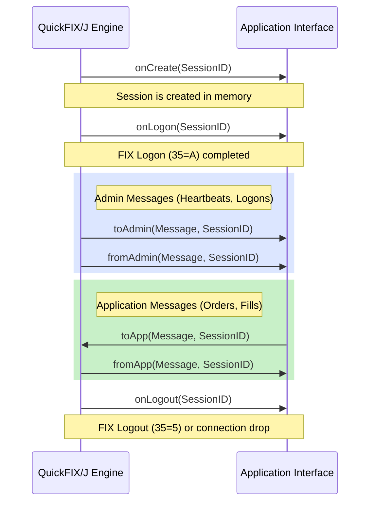

# Developer Documentation (Using QuickFIX/J)

This section provides practical guidance on how to build applications using QuickFIX/J, handle message callbacks, and construct strongly-typed FIX messages.

## The Application Interface

Your main interaction with QuickFIX/J is through the `quickfix.Application` interface. You must provide an implementation of this interface when bootstrapping the engine.



```java
import quickfix.*;

public class MyApplication implements Application {

    @Override
    public void onCreate(SessionID sessionId) {
        // Called when QuickFIX/J creates a new session internally.
    }

    @Override
    public void onLogon(SessionID sessionId) {
        // Called when a successful FIX Logon (35=A) has occurred.
    }

    @Override
    public void onLogout(SessionID sessionId) {
        // Called when a FIX Logout (35=5) has occurred or the connection dropped.
    }

    @Override
    public void toAdmin(Message message, SessionID sessionId) {
        // Called BEFORE an admin message is sent out.
        // Use this to inject passwords, usernames, or custom tags into the Logon message.
    }

    @Override
    public void fromAdmin(Message message, SessionID sessionId) throws FieldNotFound, IncorrectDataFormat, IncorrectTagValue, RejectLogon {
        // Called when an incoming admin message is received.
    }

    @Override
    public void toApp(Message message, SessionID sessionId) throws DoNotSend {
        // Called BEFORE an application message (e.g., NewOrderSingle) is sent out.
    }

    @Override
    public void fromApp(Message message, SessionID sessionId) throws FieldNotFound, IncorrectDataFormat, IncorrectTagValue, UnsupportedMessageType {
        // Called when a valid application message is received.
    }
}
```

## Receiving Messages

In QuickFIX/J, messages are primarily received through the `fromApp` method of your application. There are three main approaches to retrieving data from these messages.

### 1. Recommended Approach: Most Type Safe (MessageCracker)

This is the highly encouraged method. It uses specific message classes generated from FIX specifications and a `MessageCracker` to "crack" the generic message into its specific type.

Your application should extend `MessageCracker` and implement `quickfix.Application`. You then call `crack(message, sessionID)` inside your `fromApp` method, and define `onMessage` handlers for the specific FIX messages you want to process.

```java
import quickfix.*;
import quickfix.fix44.ExecutionReport;

public class MyCrackerApp extends quickfix.MessageCracker implements quickfix.Application {
    
    // ... implement other Application methods ...

    @Override
    public void fromApp(Message message, SessionID sessionId) 
            throws FieldNotFound, IncorrectDataFormat, IncorrectTagValue, UnsupportedMessageType {
        // Let the MessageCracker figure out the specific type and call the right method
        crack(message, sessionId);
    }

    // Strongly-typed handler for FIX 4.4 Execution Reports
    public void onMessage(ExecutionReport message, SessionID sessionID) 
            throws FieldNotFound, UnsupportedMessageType, IncorrectTagValue {
        
        // Use strongly-typed field getters
        String orderId = message.getOrderID().getValue();
        char execType = message.getExecType().getValue();
        
        System.out.println("Execution for " + orderId + " with status " + execType);
        
        if (message.isSetLastPx()) {
            double fillPrice = message.getLastPx().getValue();
            System.out.println("Filled at price: " + fillPrice);
        }
    }
}
```
*Note: Any message type for which you haven't defined a handler will throw an `UnsupportedMessageType` exception by default.*

### 2. Functional Interfaces (Lambda Support)
For versions 1.16 and newer, you can use `ApplicationFunctionalAdapter` to handle messages using lambda expressions.

```java
ApplicationFunctionalAdapter adapter = new ApplicationFunctionalAdapter(new MyApplication());

adapter.addFromAppListener(quickfix.fix44.Email.class, (email, sessionID) -> {
    // Handle the email message here
});
```

### 3. Alternative Approaches to Field Retrieval
If you are not using a `MessageCracker`, you can retrieve fields directly from the generic `Message` object.

* **More Type Safe (Field Classes):** Use field classes (e.g., `Price`, `ClOrdID`).
  ```java
  Price price = new Price();
  message.getField(price);
  ```
* **Least Type Safe:** Use tag numbers directly. This is strongly discouraged.
  ```java
  StringField field = new StringField(44);
  message.getField(field);
  ```

## Sending Messages

Messages are sent using the static `Session.sendToTarget` methods.

```java
public static boolean sendToTarget(Message message) throws SessionNotFound
public static boolean sendToTarget(Message message, SessionID sessionID) throws SessionNotFound
public static boolean sendToTarget(Message message, String senderCompID, String targetCompID) throws SessionNotFound
```

### Recommended Approach: Most Type Safe

This method uses generated message classes that enforce FIX specifications at compile time. The constructor requires all mandatory fields, and the `set()` method ensures only valid fields for that message type are added.

```java
import quickfix.Session;
import quickfix.SessionNotFound;
import quickfix.fix44.NewOrderSingle;
import quickfix.field.*;

public void sendOrder(SessionID sessionID) {
    // Constructor requires mandatory fields for NewOrderSingle
    NewOrderSingle order = new NewOrderSingle(
        new ClOrdID("ORDER-12345"),
        new Side(Side.BUY),
        new TransactTime(),
        new OrdType(OrdType.LIMIT)
    );
    
    // Add additional optional fields using setters
    order.set(new Symbol("AAPL"));
    order.set(new OrderQty(100));
    order.set(new Price(150.25));
    order.set(new TimeInForce(TimeInForce.DAY));

    try {
        // Send the message asynchronously via the session
        boolean success = Session.sendToTarget(order, sessionID);
        if (!success) {
            System.err.println("Message could not be routed. Session may be disconnected.");
        }
    } catch (SessionNotFound e) {
        System.err.println("Session not found: " + sessionID);
    }
}
```

### Alternative: Less Type Safe
If you need to work across multiple FIX versions or message types, you can construct a generic `Message` object.

```java
import quickfix.*;
import quickfix.field.*;

void sendOrderCancelRequest() {
    Message message = new Message();
    Header header = message.getHeader();
    
    header.setField(new BeginString("FIX.4.2"));
    header.setField(new SenderCompID("TW"));
    header.setField(new TargetCompID("TARGET"));
    header.setField(new MsgType("F")); // F = OrderCancelRequest
    
    message.setField(new OrigClOrdID("123"));
    message.setField(new ClOrdID("321"));
    message.setField(new Symbol("LNUX"));
    message.setField(new Side(Side.BUY));
    message.setField(new Text("Cancel My Order!"));
    
    try {
        Session.sendToTarget(message);
    } catch (SessionNotFound e) {
        // Handle error
    }
}
```

### Note on Threading
`Session.sendToTarget()` is thread-safe. You can call it from any thread in your application. The message will be serialized, persisted to the `MessageStore`, and placed on the socket's write buffer asynchronously.
