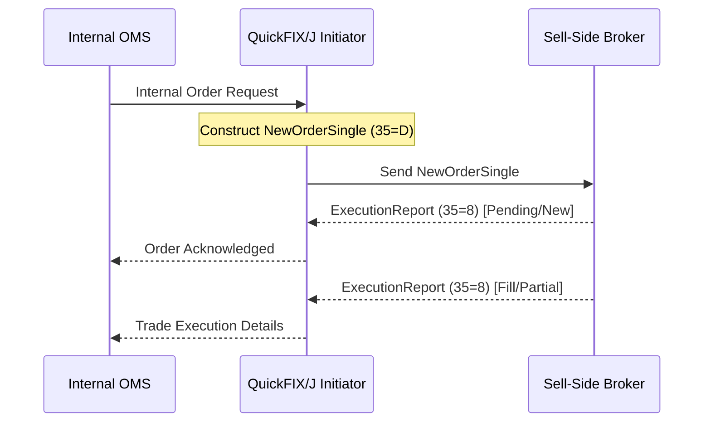
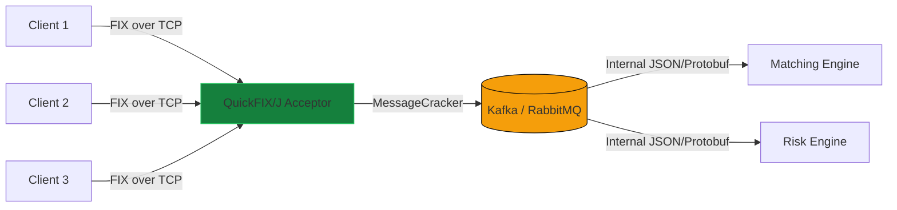

# Use Cases

QuickFIX/J is highly versatile and heavily adopted across various segments of the financial industry. Here are common scenarios where QuickFIX/J excels and how it is typically deployed.

## 1. Buy-Side: Order Routing to Brokers

Asset managers, hedge funds, and algorithmic trading desks use QuickFIX/J to connect their internal Order Management Systems (OMS) or Execution Management Systems (EMS) to multiple broker-dealers via a unified API.

* **Implementation**: QuickFIX/J acts as an **Initiator**, dialing outward into sell-side execution venues.
* **Workflow**: 
  1. The internal OMS generates a trade decision.
  2. The application layer translates the internal order into a QuickFIX/J `NewOrderSingle` message.
  3. The message is routed to the target broker's session using `Session.sendToTarget()`.
  4. QuickFIX/J handles the incoming `ExecutionReport` messages in the `fromApp` callback to update the OMS state (Fills, Partial Fills, Rejections).

## 2. Sell-Side: Exchange Connectivity

Broker-dealers and clearers deploy QuickFIX/J to maintain persistent, highly reliable connections to global exchanges (e.g., CME, Eurex, NYSE). 

* **Implementation**: Typically, QuickFIX/J acts as an **Initiator** connecting to exchange gateways.
* **Challenge**: Exchanges often enforce strict compliance rules and custom FIX dialects.
* **Solution**: QuickFIX/J allows the deployment of custom XML `DataDictionaries`. This handles strict sequence number management, aggressive heartbeat intervals, and specialized logon procedures (such as setting repeating password/username tags dynamically in the `toAdmin` callback).

## 3. FIX Gateway / Router

Firms that provide SaaS trading platforms often need to accept connections from hundreds of downstream clients.

* **Implementation**: QuickFIX/J acts as an **Acceptor** binding to a port (e.g., 9877) and accepting incoming TCP connections.
* **Challenge**: Managing many clients and routing messages appropriately.
* **Solution**: Using the `DynamicAcceptorSessionProvider`, QuickFIX/J can dynamically create sessions for unknown clients based on incoming `Logon` messages, provided they pass authentication checks. Messages are then routed to internal message queues (like Kafka or RabbitMQ) for downstream processing.

## 4. Market Data Feed Handlers

While FIX is heavily used for order routing, many venues also provide market data (prices, book updates) over FIX.

* **Implementation**: QuickFIX/J processes `MarketDataSnapshotFullRefresh` and `MarketDataIncrementalRefresh` messages.
* **Challenge**: Parsing market data via FIX can be extremely CPU-intensive due to the high volume and repeating groups.
* **Solution**: 
  * Turn off persistence (`PersistMessages=N`) so disk I/O does not bottleneck the feed.
  * Use the `MemoryStore`.
  * Turn off strict validation (`ValidateFieldsOutOfOrder=N`, `ValidateChecksum=N`) to save CPU cycles on parsing.
  * QuickFIX/J's NIO architecture via Apache MINA handles large bursts of TCP market data without exhausting thread pools.

## 5. Internal Microservices Bridge

Modern trading architectures decompose monolithic applications into microservices (e.g., Risk Engine, Pricing Engine, Execution Engine). Instead of proprietary REST or gRPC calls, some firms use internal FIX routing to pass messages between services.

* **Implementation**: Deploy both **Initiators** and **Acceptors** within an internal VPC.
* **Benefit**: Using FIX internally provides a standardized financial data model across all components. It makes components interchangeable and simplifies compliance logging, as all internal messaging is already in an industry-standard format.
