# Validation

QuickFIX/J can validate messages that do not conform to the FIX specifications. This means that it will reject poorly formed messages without bothering your application-level code. 

```mermaid
flowchart TD
    A[Incoming Raw Message] --> B[Parse Bytes & Basic Structure]
    B --> C{UseDataDictionary=Y?}
    C -- No --> D[Bypass Dictionary Checks]
    C -- Yes --> E[Validate against DataDictionary XML]
    
    E --> F{Is Valid?}
    F -- Yes --> G[Dispatch to fromApp / fromAdmin]
    F -- No --> H[Generate Session-Level Reject 35=3]
    H --> I[Drop Message<br>Do not notify Application]
    
    style G fill:#14532d,stroke:#22c55e
    style H fill:#450a0a,stroke:#ef4444
    style I fill:#450a0a,stroke:#ef4444
```



QuickFIX/J dynamically loads an XML definition file for each session, which it uses to validate if a message is of the right type, if it contains unsupported fields, or if required fields are missing.

QuickFIX/J comes with several default definition files: `FIX40.xml`, `FIX41.xml`, `FIX42.xml`, `FIX43.xml`, `FIX44.xml`, and `FIXT11.xml`. These are generated directly from the respected FIX specification documents.

## Customizing Validation

The true power comes in modifying these documents or creating new ones for your specific needs. If you need to define a FIX spec for a sell-side application, you define the spec in XML and publish it to your clients. 

If a specific counterparty (e.g., XYZ corp) needs special fields added to their session but you don't want to expose them to anyone else, you create `XYZ.xml`, load it into their specific session configuration, and keep everyone else using the normal definition file.

### Skeleton of a Definition File

```xml
<fix major="4" minor="1">
  <header>
    <field name="BeginString" required="Y"/>
    ...
  </header>
  <trailer>
    <field name="CheckSum" required="Y"/>
    ...
  </trailer>
  <messages>
    <message name="Heartbeat" msgtype="0" msgcat="admin">
      <field name="TestReqID" required="N"/>
    </message>
    ...
    <message name="NewOrderSingle" msgtype="D" msgcat="app">
      <field name="ClOrdID" required="Y"/>
      ...
    </message>
    ...
  </messages>
  <fields>
    <field number="1" name="Account" type="CHAR" />
    ...
    <field number="4" name="AdvSide" type="CHAR">
     <value enum="B" description="BUY" />
     <value enum="S" description="SELL" />
    </field>
   ...
  </fields>
</fix>
```

*Note: The validator will not reject conditionally required fields because the rules for them are not clearly defined and are often debatable. QuickFIX/J will reject a conditionally required field when you try to pull it out in your `fromApp` function if you attempt to get a field that isn't present.*
